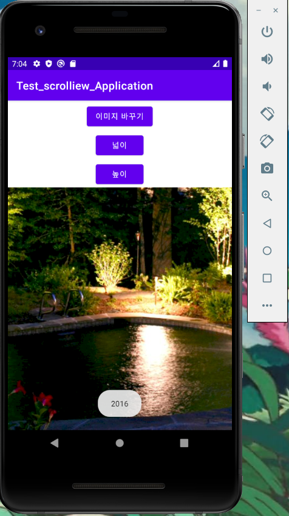

# 20273028_myj_androidApp

## 2주차 과제
- </img>

## 3주차 과제
- </img> </img>

## 4주차 과제
    - 습관 루틴 형성 앱(자기계발)
    : 일차적인 목표를 적고 그 목표에 대한 필요 습관을 형성하기 위한 앱이다. 
    필요한 생활 습관에 관해 적고 일정시간에 알람을 정해둔다. 기본적으로 물마시기, 운동, 약 복용과 같이 건강 관련 정보와 알람을 기본적으로 제공한다.
    또한 필요한 하루의 계획 작성도 할 수 있어 하루의 효율적인 시간분배와 일의 우선순위를 정할 수 있도록 도와준다.

## 5주차 과제
- </img> </img>

## 6주차 과제
-  </img> </img> - 이미지 바뀜 </img> - width 값  </img> - height 값

## 7주차 과제
- </img>

## 9주차 과제 
- </img> </img> - layer-list

## 10주차 과제
- </img> </img>
- </img> </img>

## 11주차 과제
- </img>

## 12주차 과제
- </img>

## 13주차 과제
- </img> </img>
